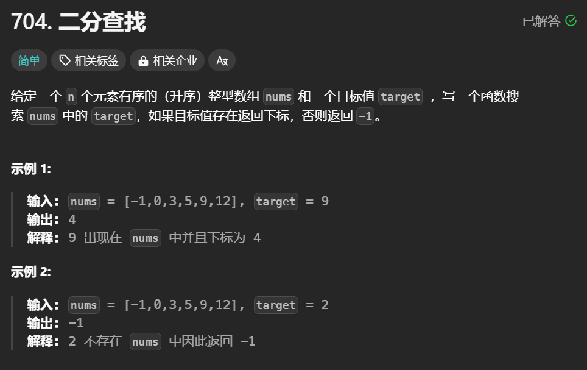

# 关于二分查找



## 关键点

- 二分查找仅适用于有序数组，且数组中元素不应重复。
- 二分查找的核心思想是通过不断缩小查找区间来定位目标值。
- 有两种边界定义方式：左闭右闭区间及左闭右开区间，影响代码逻辑。
- 在左闭右闭区间中，循环条件为 `left <= right`。
- 在左闭右开的区间中，循环条件为 `left < right`。
- 二分查找的时间复杂度为 O(log n)，空间复杂度为 O(1)。
- 对于初学者，常出现不清晰定义区间导致的代码错误，需要坚持循环不变量规则。

## 情况不适合使用二分查找

1. **数组未排序**：二分查找要求输入必须是有序数组；如果数组未排序，使用该算法将得不到正确结果。
2. **小规模数据**：对于小数组，线性查找可能更有效，因为它的开销较小，实现简单。
3. **不适合链表**：在链表中访问元素的时间是 O(n)，因此二分查找无法有效利用其时间复杂度。
4. **动态数据结构**：频繁对数组进行插入或删除操作会影响其顺序，导致维护开销过大。
5. **重复元素问题**：当数组中存在重复元素时，二分查找无法保证找到首个或最后一个目标值的准确性。
6. **特殊数据类型**：对于某些复杂或自定义的数据结构，二分查找也可能不适用。

---

## 使用左闭右闭区间和左闭右开区间的情况

### 注意 1

*使用`int mid = left + (right - left) / 2;`是为了避免整型溢出的问题。* 当 `left` 和 `right` 的值很大时，直接相加可能导致计算结果超出 `int` 能表示的范围，而先计算差值再进行加法，就可以确保整个过程在安全的数值范围内进行。这种做法让代码更健壮，有助于避免潜在的错误。

### 注意 2

左闭右开与左闭右闭循环条件的详细分析

1. **左闭右闭区间**：
   - **循环条件**：`left <= right`
   - **原因**：
     - **包括右边界**：需要包括右边界的元素，因此当 `left` 和 `right` 相等时，`middle` 仍可能是目标值，所以不能立即跳出循环。
     - **处理退出条件**：当 `left` 超过 `right` 时，确认查找结束，并且目标值未在这个范围内。

   - **示例代码**：

     ```cpp
     while (left <= right) {
         int mid = left + (right - left) / 2;
         // 检查 mid 的值是否为目标
         ...
     }
     ```

2. **左闭右开区间**：
   - **循环条件**：`left < right`
   - **原因**：
     - **不包括右边界**：`right` 代表的是不包含的上界，因此当 `left` 等于 `right` 时，说明查找结束。
     - **允许缩小范围**：可以在每次迭代中使用 `right` 来控制 `middle` 的计算，将其排除在下次迭代中。
  
   - **示例代码**：

     ```cpp
     while (left < right) {
         int mid = left + (right - left) / 2;
         // 检查 mid 的值是否为目标
         ...
     }
     ```

- **左闭右闭区间**使用 `left <= right`，可以确保所有可能的目标值都被考虑到，而 **左闭右开区间**使用 `left < right`，能够有效地剔除已检查的位置，简化逻辑。
- 理解这两者的区别有助于实现高效的查找算法，并避免潜在的逻辑错误。

---

### 详解

1. **左闭右闭区间  [left, right ]**：
   - **适用场景**：
     - 需要包括右边界元素的查找或范围判断。
     - 例如，您想要查找目标值或最后一个小于或等于目标值的元素，并带有全区间的遍历。
   - **示例代码**：

     ```cpp
     int binarySearch(vector<int>& nums, int target) {
         int left = 0, right = nums.size() - 1;
         while (left <= right) {
             int mid = left + (right - left) / 2;
             if (nums[mid] == target) {
                 return mid; // 找到目标
             } else if (nums[mid] < target) {
                 left = mid + 1; // 继续搜索右半边
             } else {
                 right = mid - 1; // 继续搜索左半边
             }
         }
         return -1; // 未找到
     }
     ```

     ```Java
     public int search(int[] nums, int target) {
        public int search(int[] nums, int target) {
        int left = 0, right = nums.length - 1;

        while (left <= right) {
            int mid = left + (right - left) / 2;

            if (nums[mid] == target) {
                return mid;
            } else if (nums[mid] < target) {
                left = mid + 1;
            } else {
                right = mid - 1;
            }
        }

        return -1;
     }
     ```

     ```js
     /**
        * @param {number[]} nums
        * @param {number} target
        * @return {number}
     */
      var search = function(nums, target) {
        let mid, left = 0, right = nums.length - 1;
        while (left <= right) {
        // 位运算 + 防止大数溢出
            mid = left + ((right - left) >> 1);
        // 如果中间数大于目标值，要把中间数排除查找范围，所以右边界更新为mid-1；如果右边界更新为mid，那中间数还在下次查找范围内
            if (nums[mid] > target) {
                right = mid - 1;  // 去左面闭区间寻找
            } else if (nums[mid] < target) {
                left = mid + 1;   // 去右面闭区间寻找
            } else {
                return mid;
            }
        }
        return -1;
     };
     ```

2. **左闭右开区间  [left, right)**：
   - **适用场景**：
     - 当需要查找一个可能的插入位置，且保证`right`不包含已经查找的元素。
     - 适于返回某个值应该被插入的位置，而不会影响既有元素的顺序。
   - **示例代码**：

     ```cpp
     int searchInsert(vector<int>& nums, int target) {
         int left = 0, right = nums.size(); // 注意right是 nums.size()
         while (left < right) { // 注意条件
             int mid = left + (right - left) / 2;
             if (nums[mid] < target) {
                 left = mid + 1; // 目标在右半边
             } else {
                 right = mid; // 目标在左半边，包括中间
             }
         }
         return left; // 最终位置
     }
     ```

     ```Java
     public int search(int[] nums, int target) {
        int left = 0, right = nums.length;

        while (left < right) {
            int mid = left + (right - left) / 2;

            if (nums[mid] == target) {
                return mid;
            } else if (nums[mid] < target) {
                left = mid + 1;
            } else {
                right = mid ;
            }
        }

        return -1;
     }
     ```

     ```js
     /**
        * @param {number[]} nums
        * @param {number} target
        * @return {number}
     */
     var search = function(nums, target) {
        let mid, left = 0, right = nums.length ;
        while (left < right) {
        // 位运算 + 防止大数溢出
            mid = left + ((right - left) >> 1);
        // 如果中间数大于目标值，要把中间数排除查找范围，所以右边界更新为mid-1；如果右边界更新为mid，那中间数还在下次查找范围内
            if (nums[mid] > target) {
                right = mid;  // 去左面闭区间寻找
            } else if (nums[mid] < target) {
                left = mid + 1;   // 去右面闭区间寻找
            } else {
                return mid;
            }
        }
        return -1;
     };
     ```

---

### 如何优化二分查找算法以应对更复杂的数据结构

1. **理解二分查找的原则**：
   - 二分查找适用于有序数据结构，因此任何优化都需要保持数据的有序性。

2. **适配复杂数据结构**：
   - **动态数组和链表**：
     - 对于动态数组，维持一个有序状态，二分查找可以直接应用。
     - 对于链表，因不能随机访问，需要考虑先将链表的数据复制到数组中，或使用更适合线性结构的查找方法，如线性查找或跳表。

   - **树结构（如二叉搜索树）**：
     - 在树结构中，可以直接利用树的性质来进行查找，避免数组的环境。例如使用平衡树（如红黑树），提取其有序性质，保证 O(log n) 的查找复杂度。

   - **自定义对象**：
     - 在应用二分查找于自定义对象数组时，需要实现对象之间的比较逻辑，例如重载比较运算符或使用比较函数。

     ```cpp
     struct Person {
         int age;
         std::string name;
     };

     bool compareByAge(const Person& a, const Person& b) {
         return a.age < b.age; // 以年龄为标准
     }
     ```

3. **结合二分查找与其他算法**：
   - 在处理频繁查找的场景，可以先对数据进行排序，然后使用二分查找。
   - 对于动态变化的数据集，可以考虑使用索引来减小查找范围，如在数据库中使用索引技术。

4. **优化示例**：
   - **基于数据结构的二分查找示例**：

   ```cpp
   int binarySearchObjects(std::vector<Person>& people, const Person& target, bool (*compare)(const Person&, const Person&)) {
       int left = 0, right = people.size() - 1;
       while (left <= right) {
           int mid = left + (right - left) / 2;
           if (compare(people[mid], target)) {
               left = mid + 1;  // 查找右半边
           } else if (compare(target, people[mid])) {
               right = mid - 1; // 查找左半边
           } else {
               return mid; // 找到目标
           }
       }
       return -1; // 未找到
   }
   ```

5. **性能和复杂性考虑**：
   - 始终考虑选择合适的算法和数据结构组合，以最佳的复杂度应对实际需求。
   - 避免不必要的排序或数据搬移，以保持性能高效。

6. **总结与注意事项**：
   - 选择数据结构时，始终关注其适用性以及在使用二分查找时的效率。
   - 在复杂数据结构上应用二分查找时，合理设计数据间的关系及比较逻辑，以确保查找的准确性和高效性。

## 二分法的时间复杂度和空间复杂度分析

1. **时间复杂度**：
   - 二分法的时间复杂度为 O(log n)。
   - **分析过程**：
     - 每次迭代中，查找区间的大小从 `n` 缩小到 `n/2`。
     - 迭代次数 k 满足 `n/(2^k) = 1`，解得 `k = log2(n)`。
     - 因此，查找的时间复杂度是对数级别的，适合处理大规模数据集。

2. **空间复杂度**：
   - **迭代实现**：空间复杂度为 O(1)。
     - 只需固定数量的变量（如 `left`, `right`, `middle`），不需要额外的存储空间。
   - **递归实现**：空间复杂度为 O(log n)。
     - 每次递归调用会消耗栈空间，递归深度为 O(log n)。

### 总结

- **时间复杂度**：O(log n)（高效，适合大规模数据）
- **空间复杂度**：O(1)（迭代实现）或 O(log n)（递归实现）
