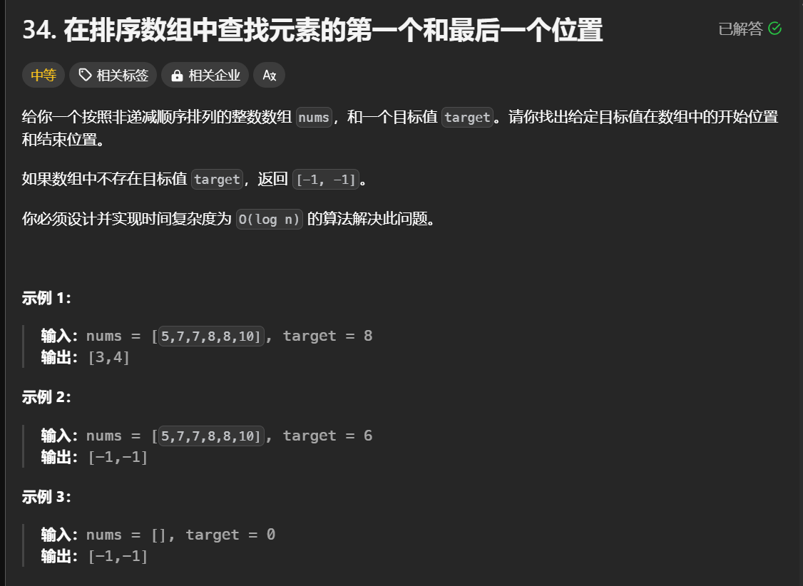

# 在排序数组中查找元素的第一个和最后一个位置

## 问题如图



### 问题分析

题目要求在给定的排序数组中查找目标值 `target` 的**第一个**和**最后一个**位置，并返回一个包含这两个位置的数组。如果目标值不存在，则返回 `[-1, -1]`。除此之外，算法时间复杂度要求为 `O(log n)`，这表明应使用**二分查找**解决问题。

---

### 解题思路

为实现题目要求，关键在于利用二分查找的特性，分别找到：

1. **目标值的第一个位置**（即左边界）
2. **目标值的最后一个位置**（即右边界）

以下是具体步骤：

1. **二分查找模板**：
    - 在 `search` 函数中，调整二分查找的边界逻辑；  
    - 这个函数在数组中返回第一个**大于等于目标值的位置**。  
      - 如果 `目标值的第一个位置` 未找到，直接返回数组长度或其他无效位置；  
      -函数会利用 `nums[mid] < target` 决定中点。

2. **找到左边界**：
   利用 `search` 函数确定目标元素 `target` 的首次出现位置。

3. **找到右边界**：
   利用 `target+1` 进行二分查找，借助返回结果减 1 得到右边界。

4. **判断有效性**：
   检查左边界 `start` 是否越界，若目标元素不存在，直接返回 `[-1, -1]`。

---

### 代码解析

以下是题目中代码的详细分析与实现：

```java
class Solution {

    // 辅助函数：二分查找第一个 >= target 的位置
    public int search(int[] nums, int target) {
        int left = 0, right = nums.length - 1; // 初始化指针

        while (left <= right) { // 标准二分查找模板
            int mid = left + (right - left) / 2; // 中点计算，避免整数溢出
            if (nums[mid] < target) { // 如果中值小于目标值，向右查找
                left = mid + 1;       // 左边界右移
            } else {                  // 否则向左查找
                right = mid - 1;      
            }
        }

        return left; // 返回左边界
    }

    // 主函数：查找目标值的第一个和最后一个位置
    public int[] searchRange(int[] nums, int target) {
        int start = search(nums, target); // 找到第一个 >= target 的位置

        // 如果左侧边界越界，或者当前起始位置不等于目标值，说明目标值不存在
        if (start == nums.length || nums[start] != target) {
            return new int[]{-1, -1}; 
        }

        // 找到右边界：查找第一个 >= target+1 的位置，再减一
        int end = search(nums, target + 1) - 1;

        return new int[]{start, end}; // 返回结果
    }
}
```

---

### 解题逻辑详解

1. **`search` 函数的核心逻辑**：
   此函数通过二分查找，返回数组中第一个**大于等于目标值**的位置：
   - 若找到目标值，则返回其位置；
   - 若未找到，则返回应插入的位置（即目标值的上界位置）。

2. **左边界确定 `start`**：
   调用 `search(nums, target)`，目的是找到第一个 `>= target` 的位置。如果返回的索引位置不合法或目标值不存在（值不等于目标值），返回 `[-1, -1]`。

3. **右边界确定 `end`**：
   调用 `search(nums, target + 1)`，目的是找到第一个 `>= target + 1` 的位置，再减一即可得到目标值的右边界索引。

4. **智能处理无效情况**：
   若目标值不存在，两个边界检查均会返回 `[-1, -1]`。

---

### 示例分析

#### 示例 1

输入：

```java
nums = [5, 7, 7, 8, 8, 10]; target = 8
```

算法过程：

1. 调用 `search(nums, 8)`，找到第一个 `>= 8` 的位置，即索引 3；
2. 调用 `search(nums, 9)` 或 `search(nums, 8+1)`，返回第一个 `>= 9` 的索引，即索引 5；
3. 右边界为 `5 - 1 = 4`。

输出：

```java
[3, 4]
```

---

#### 示例 2

输入：

```java
nums = [5, 7, 7, 8, 8, 10]; target = 6
```

算法过程：

1. 调用 `search(nums, 6)`，找到第一个 `>= 6` 的位置为索引 1；
2. 检查索引值，发现目标值 6 不存在，直接返回 `[-1, -1]`。

输出：

```java
[-1, -1]
```

---

#### 示例 3

输入：

```java
nums = []; target = 0
```

算法过程：

1. 调用 `search(nums, 0)`，由于数组为空，`left` 越界，返回 0；
2. 检查目标值是否存在，返回 `[-1, -1]`。

输出：

```java
[-1, -1]
```

---

### 时间复杂度与空间复杂度

1. **时间复杂度**：
   - 每次调用 `search` 都是一次二分查找，时间复杂度为 `O(log n)`；
   - 故总时间复杂度为 `O(log n)`。

2. **空间复杂度**：
   - 算法中没有使用额外空间，空间复杂度为 `O(1)`。

---

### 总结

通过双次调用二分查找，分别定位目标值的**左边界**和**右边界**，该算法能够高效解决指定问题，满足 `O(log n)` 的时间复杂度要求，非常适合解决类似的有序数组区间查找问题。
