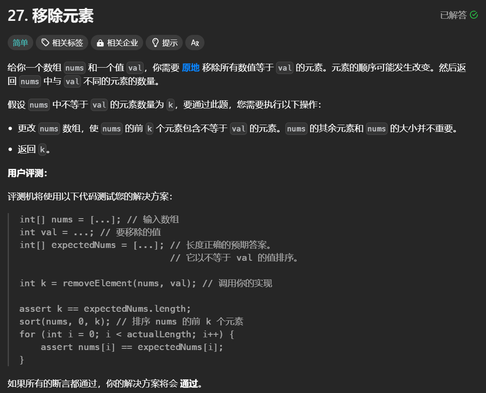

# 双指针

双指针算法非常适用于多种问题，尤其是那些涉及线性数据结构（如数组、字符串和链表）的场景。以下是双指针的适用问题类型和使用的前提条件：

## 使用的前提条件

1. **线性数据结构**：数据必须是线性的（如数组、字符串、链表等）。
2. **状态可分解**：问题应能够分解成两个部分，这两部分之间有某种关系，可以通过移动指针来逐步逼近解。
3. **明确的指针移动规则**：需要能够清晰定义指针在满足特定条件时如何移动，以及何时停止。
4. **避免冲突**：指针在过程中不会出现重叠或越界等问题，这可能会导致错误结果。

## 双指针的基本概念

双指针算法有两个主要类型：

1. **相向双指针**：通常用于从数组的两端同时开始搜索，以找到某种满足条件的元素。例如，在找两数之和的经典问题中，我们可以将一个指针放在数组的开始位置，另一个指针放在数组的结束位置，逐步向中间靠拢。
2. **同向双指针**：这种方法通常用在滑动窗口问题上，其中一个指针负责扩展窗口，而另一个指针负责收缩窗口。这种方式常用来处理具有某种特定条件的子数组或子序列的问题。

### 解题思路

使用双指针解决问题时，可以按照以下步骤进行：

1. 初始化指针：根据问题的特点，设定指针的起始位置（如开始和结束）。
2. 移动指针：根据特定条件更新指针位置（例如减小窗口，或找到数值并更新状态）。
3. 检查条件：在每次移动后验证当前状态是否满足条件。
4. 结束条件：循环直至指针相遇或达到边界条件。

### 时间复杂度分析

双指针算法使得问题的时间复杂度通常可以达到 O(n)，而不是暴力解法中的 O(n^2)。通过将问题分成两个小的部分进行查找，大大减少重复计算的可能。

### 应用场景

1. **有序数组中的特定元素**：
   - 在两个有序数组中寻找共同元素或计算交集。可以使用一个指针遍历第一个数组，另一个指针遍历第二个数组，从而有效地找出交集。
  
2. **两数之和**：
   - 给定一个有序数组和一个目标值，可以用双指针找出数组中两个数的和等于目标值的组合。在一个指针从左向右移动的同时，另一个指针从右向左移动，根据两者的和进行调整。

3. **链表的环检测**：
   - 利用快慢指针法检测链表是否有环。一个指针每次移动一步，另一个每次移动两步，如果存在环，两个指针最终会相遇。

4. **字符串的回文检查**：
   - 使用双指针从字符串的两端向中间移动，逐个比较字符是否相等，从而判断字符串是否为回文。

5. **反转字符串**：
   - 可以使用双指针分别指向字符串的开头和结尾，然后交换两个指针所指向的字符，逐步向中间移动，直到所有字符都被交换。

6. **三数之和**：
   - 给定一个数组，找到其中三个数的和为零的所有组合。可以先对数组排序，然后固定一个数后用双指针寻找另外两个数。

7. **合并两个有序链表**：
   - 利用双指针法分别指向两个链表的当前节点，逐步比较节点值并构建合并链表。

8. **滑动窗口**：
   - 在处理某些子串或子数组问题时，可以使用双指针维护一个窗口，通过调整两个指针来扩大或缩小窗口，来满足特定的条件。

## 关于移除元素



### 关键点

- **问题描述**：需要在数组中原地移除所有数值等于指定值val的元素，同时返回移除后新数组的长度。
- **暴力解法**：简单直接，通过两层循环实现，时间复杂度为O(n^2)。
- **双指针法**：利用快慢指针高效实现元素移除，时间复杂度降低到O(n)。
- **元素顺序**：移除元素后，数组的顺序可以改变，用户不需关注超出新长度后的元素。
- **空间复杂度**：两种方法均使用O(1)的额外空间，符合题目要求。

### Java 解法

**暴力解法**：

```java
class Solution {
    public int removeElement(int[] nums, int val) {
        int n = nums.length;
        
        for (int i = 0; i < n; i++) {
            if (nums[i] == val) {
                for (int j = i; j < n - 1; j++) {
                    nums [j] = nums [j + 1];
                }

                n--;
                i--;
            }

        }

        return n;
    }
}
```

**双指针法**：

```java
class Solution {
    public int removeElement(int[] nums, int val) {
        int n = nums.length;
        int left = 0;
        for (int right = 0; right < n; right++) {
            if (nums[right] != val) {
                nums[left] = nums[right];
                left++;
            }
        }
        return left;
    }
}
```

## C++ 解法

**暴力解法**：

```cpp
class Solution {
public:
    int removeElement(vector<int>& nums, int val) {
        int size = nums.size();
        for (int i = 0; i < size; i++) {
            if (nums[i] == val) {
                // 发现需要移除的元素，就将数组集体向前移动一位
                for (int j = i + 1; j < size; j++) {
                    nums[j - 1] = nums[j];
                }
                i--; // 因为下标i以后的数值都向前移动了一位，所以i也向前移动一位
                size--; // 此时数组的大小-1
            }
        }
        return size;
    }
};
```

**双指针法**：

```cpp
class Solution {
public:
    int removeElement(vector<int>& nums, int val) {
        int left = 0;
        for (int right = 0; right < nums.size(); right++) {
            if (val != nums[right]) {
                nums[left++] = nums[right];
            }
        }
        return left;
    }
};
```

### JavaScript 解法

**暴力解法**：

```js
var removeElement = function(nums, val) {
    let size = nums.length;
    for (let i = 0; i < size; i++) {
        if (nums[i] == val) {
            for (let j = i; j < size - 1; j++) {
                nums[j] = nums[j + 1];
            }

            i--;
            size--;
        }
    }
    return size;
};
```

**双指针法**：

```js
var removeElement = function(nums, val) {
    let slowIndex = 0;
    for (let fastIndex = 0; fastIndex < nums.length; fastIndex++) {
        if (nums[fastIndex] !== val) {
            nums[slowIndex++] = nums[fastIndex];
        }
    }
    return slowIndex;
};
```
